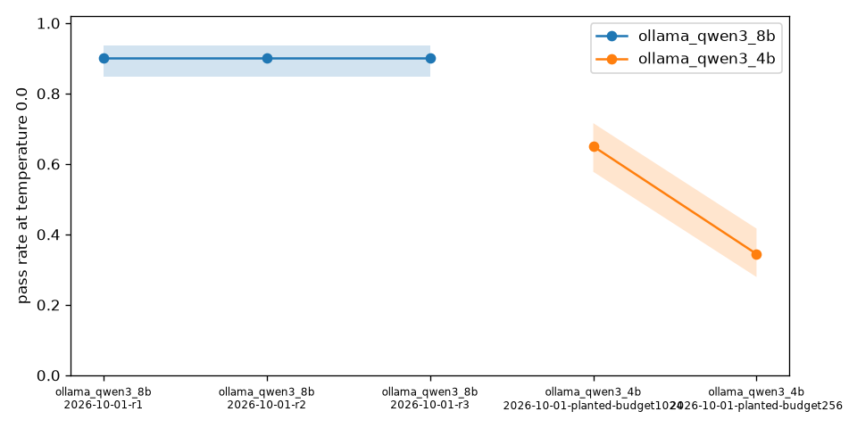
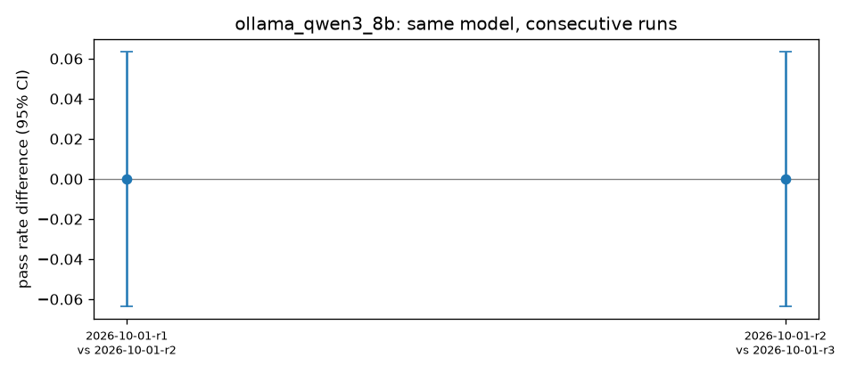
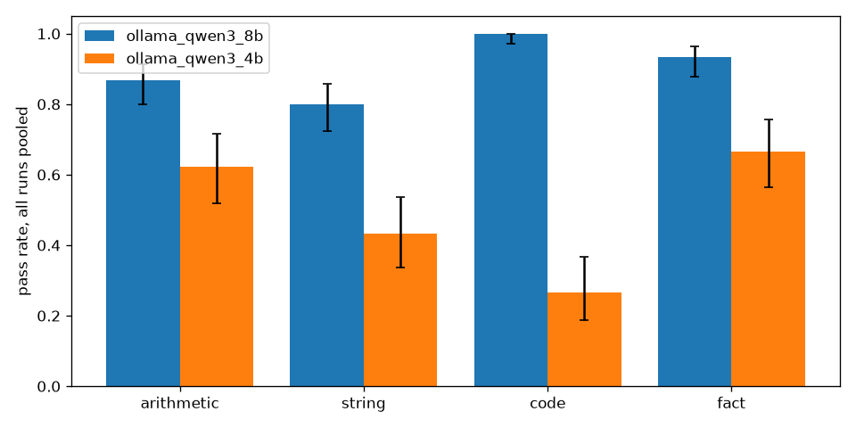

# model-nerf-watch

A cheap daily canary for "is my model getting worse?", with confidence
intervals and a measured noise floor.

People keep saying the model they pay for got quietly worse. One Hacker News
comment: "it's so easy to check, but nobody ever proves it." This repo is an
attempt to check it properly on a laptop: a fixed set of 60 short probes with
programmatic answers, sampled several times per run, with Wilson intervals on
every pass rate, a paired test between runs, and a stated detection limit. The
honest result is the noise floor, measured by running the same model against
itself. Everything below is from files in `results/` and is re-derived in CI
by `scripts/check_numbers.py`.

## Results

Model under watch: `qwen3:8b` through local Ollama (Q4_K_M, thinking turned
off with `think: false`). Three full runs on the same day, each probe sampled
3 times at temperature 0 and 3 times at 0.7, so 180 samples per run per
temperature.

### Pass rate per run, temperature 0

| run | pass | n | rate | 95% Wilson CI |
|---|---|---|---|---|
| r1 | <!-- num:ollama_qwen3_8b.r1.k -->162 | <!-- num:ollama_qwen3_8b.r1.n -->180 | <!-- num:ollama_qwen3_8b.r1.rate -->0.900 | <!-- num:ollama_qwen3_8b.r1.lo -->0.847 to <!-- num:ollama_qwen3_8b.r1.hi -->0.936 |
| r2 | <!-- num:ollama_qwen3_8b.r2.k -->162 | <!-- num:ollama_qwen3_8b.r2.n -->180 | <!-- num:ollama_qwen3_8b.r2.rate -->0.900 | <!-- num:ollama_qwen3_8b.r2.lo -->0.847 to <!-- num:ollama_qwen3_8b.r2.hi -->0.936 |
| r3 | <!-- num:ollama_qwen3_8b.r3.k -->162 | <!-- num:ollama_qwen3_8b.r3.n -->180 | <!-- num:ollama_qwen3_8b.r3.rate -->0.900 | <!-- num:ollama_qwen3_8b.r3.lo -->0.847 to <!-- num:ollama_qwen3_8b.r3.hi -->0.936 |

At temperature 0.7 the three runs passed <!-- num:ollama_qwen3_8b.r1.t07.k -->162,
<!-- num:ollama_qwen3_8b.r2.t07.k -->162 and <!-- num:ollama_qwen3_8b.r3.t07.k -->161
of 180. Per family at temperature 0, run 1: arithmetic
<!-- num:ollama_qwen3_8b.r1.arithmetic -->39/45, string
<!-- num:ollama_qwen3_8b.r1.string -->36/45, code
<!-- num:ollama_qwen3_8b.r1.code -->45/45, fact
<!-- num:ollama_qwen3_8b.r1.fact -->42/45. The same 6 probes fail in every
run (47 * 83, 1001 mod 7, the r's in strawberry, two string formatting tasks,
and "Yen" which the model answers as "Japanese Yen (JPY)" and which is really
a wording defect in the probe).



### The noise floor

Same model, consecutive runs, difference in pass rate at temperature 0 with a
Newcombe 95% interval, a pooled two-proportion z-test and an exact McNemar
test on the per-item majority vote:

| comparison | diff | 95% CI | z-test p | items pass to fail | fail to pass | McNemar p |
|---|---|---|---|---|---|---|
| r1 vs r2 | <!-- num:ollama_qwen3_8b.c1.diff -->+0.000 | <!-- num:ollama_qwen3_8b.c1.lo -->-0.064 to <!-- num:ollama_qwen3_8b.c1.hi -->+0.064 | <!-- num:ollama_qwen3_8b.c1.p_z -->1.00 | <!-- num:ollama_qwen3_8b.c1.b -->0 | <!-- num:ollama_qwen3_8b.c1.c -->0 | <!-- num:ollama_qwen3_8b.c1.p_mcnemar -->1.00 |
| r2 vs r3 | <!-- num:ollama_qwen3_8b.c2.diff -->+0.000 | <!-- num:ollama_qwen3_8b.c2.lo -->-0.064 to <!-- num:ollama_qwen3_8b.c2.hi -->+0.064 | <!-- num:ollama_qwen3_8b.c2.p_z -->1.00 | <!-- num:ollama_qwen3_8b.c2.b -->0 | <!-- num:ollama_qwen3_8b.c2.c -->0 | <!-- num:ollama_qwen3_8b.c2.p_mcnemar -->1.00 |



So on local Ollama at temperature 0 with a fixed seed the run to run noise
is essentially zero: 178 of 180 outputs were byte identical across runs and
the two that differed were scored the same. The interval is still 6.4 points
wide, because 180 samples is what it is. That width is the detection limit,
not the observed noise. A hosted API will not give you a fixed seed, so
expect the observed noise there to be larger than zero and to sit somewhere
inside that interval.

### What the probe set can and cannot see

`nerfwatch power --baseline 0.9 --drop X` answers "how many items per run
until a drop of X is detectable at alpha 0.05 and power 0.8":

| drop | items per run needed |
|---|---|
| 5 points | <!-- num:power.drop5 -->686 |
| 10 points | <!-- num:power.drop10 -->199 |
| 20 points | <!-- num:power.drop20 -->62 |

There are 60 probes. Treating the 3 samples per probe as independent gives
180 samples, which is enough for a 10 point drop and not for 5. Treating
them honestly as 60 correlated items, only a drop of about 20 points is
reliably visible from one run. Smaller drifts need more probes or more days
of runs pooled together. This is the main limitation and it is stated up
front rather than hidden.

### Planted degradation

To show the detector fires on a real change, `qwen3:4b` (same family,
same quantisation, half the parameters) was run through the same pipeline.
This is planted. Nobody changed qwen3:8b. Two runs were needed, and the
first one is a finding on its own.

| run | pass | n | rate | 95% CI | vs qwen3:8b r3 | z-test p | McNemar p |
|---|---|---|---|---|---|---|---|
| 4b, 256 token budget | <!-- num:ollama_qwen3_4b.r2.k -->62 | 180 | <!-- num:ollama_qwen3_4b.r2.rate -->0.344 | <!-- num:ollama_qwen3_4b.r2.lo -->0.279 to <!-- num:ollama_qwen3_4b.r2.hi -->0.416 | <!-- num:cross2.diff -->-0.556 (<!-- num:cross2.lo -->-0.630 to <!-- num:cross2.hi -->-0.466) | <!-- num:cross2.p_z -->0.0e+00 | <!-- num:cross2.p_mcnemar -->1.0e-08 |
| 4b, 1024 token budget | <!-- num:ollama_qwen3_4b.r1.k -->117 | 180 | <!-- num:ollama_qwen3_4b.r1.rate -->0.650 | <!-- num:ollama_qwen3_4b.r1.lo -->0.578 to <!-- num:ollama_qwen3_4b.r1.hi -->0.716 | <!-- num:cross1.diff -->-0.250 (<!-- num:cross1.lo -->-0.331 to <!-- num:cross1.hi -->-0.166) | <!-- num:cross1.p_z -->1.3e-08 | <!-- num:cross1.p_mcnemar -->2.6e-03 |

The current `qwen3:4b` tag on Ollama ignores `think: false` and reasons in
plain text before answering. With the same 256 token budget as the 8b model
it mostly never reached an answer. That looks like a catastrophic nerf, and
the canary reports it as one, but the cause is a format change, not a
capability change. With a 1024 token budget it finishes thinking on most
probes and lands 25 points below the 8b model. Per family at 1024: arithmetic
<!-- num:ollama_qwen3_4b.r1.arithmetic -->42/45, string
<!-- num:ollama_qwen3_4b.r1.string -->21/45, code
<!-- num:ollama_qwen3_4b.r1.code -->15/45, fact
<!-- num:ollama_qwen3_4b.r1.fact -->39/45. Code is low because the model
often still runs out of budget inside its reasoning on those probes. The
paired test saw <!-- num:cross1.b -->17 items flip from pass to fail and
<!-- num:cross1.c -->3 the other way.



The lesson I take from the planted run: a canary catches "something changed"
easily when the change is big. Telling capability loss apart from a format
or budget change needs a look at the raw outputs, which is why every output
is stored.

## How to run

```
python3 -m venv .venv && .venv/bin/pip install -r requirements.txt
.venv/bin/python -m nerfwatch run --model ollama/qwen3:8b --n 3
.venv/bin/python -m nerfwatch report
.venv/bin/python -m nerfwatch compare results/ollama_qwen3_8b/A.jsonl results/ollama_qwen3_8b/B.jsonl
.venv/bin/python -m nerfwatch power --baseline 0.9 --drop 0.1
```

`run` writes `results/<model>/<date>.jsonl`, one line per probe, temperature
and sample, with the raw output. It is resumable: rerun the same command and
it skips what is already there. Use `--run-name` to keep several runs on one
day and `--max-tokens` if the model thinks in its output.

On qwen3 models thinking has to be turned off or the answer never arrives
inside a small budget. The Ollama adapter sends `think: false`. If a model
ignores it (the current `qwen3:4b` tag does), raise `--max-tokens`; the
scorer cuts everything up to the last `</think>`.

## Hosted models

Set the key in the environment and use the provider prefix:

| prefix | env var |
|---|---|
| `openai/gpt-4o-mini` | `OPENAI_API_KEY` |
| `groq/llama-3.1-8b-instant` | `GROQ_API_KEY` |
| `openrouter/meta-llama/llama-3.1-8b-instruct` | `OPENROUTER_API_KEY` |
| `anthropic/claude-3-5-haiku-latest` | `ANTHROPIC_API_KEY` |
| `gemini/gemini-2.0-flash` | `GEMINI_API_KEY` |
| `ollama/qwen3:8b` | `OLLAMA_HOST` (optional) |

Adapters are plain `urllib`, no SDKs. Only Ollama has been run here; the
others are tested against recorded response fixtures in `tests/fixtures/`.
Run a hosted model once a day with `--run-name $(date +%F)` and `report`
will draw the drift plot.

## Layout

- `nerfwatch/providers.py` request building and response parsing per provider
- `nerfwatch/probes.py` loading and scoring, no LLM judge
- `nerfwatch/stats.py` Wilson, Newcombe, two-proportion z, exact McNemar, power
- `nerfwatch/runner.py` resumable sampling loop
- `nerfwatch/report.py` tables, figures, `summary.json`
- `probes/*.jsonl` the 60 probes in 4 families
- `results/` every raw output and the derived figures
- `scripts/check_numbers.py` fails CI if the README disagrees with the data
- `notes/LOGBOOK.md` what was tried, including what went wrong
- `METHODOLOGY.md` the rules

## Limitations

- 60 probes sees 20 point drops from one run, not 5 point drifts.
- All runs so far are on one day and one machine. Drift over weeks is what
  this is for and that data does not exist yet.
- Exact string matching is strict. Some "failures" are the model being
  slightly more helpful than asked. That is counted as a fail on purpose,
  since instruction following is part of what people complain about, but it
  does mean the absolute pass rate is not a capability score.
- Code probes run model output in-process with a 2 second alarm. Run it on a
  machine you do not mind the model touching.
- The planted degradation is a different model, not a quietly changed one.
  It shows the detector fires, not that a provider ever did this.

MIT licence.
